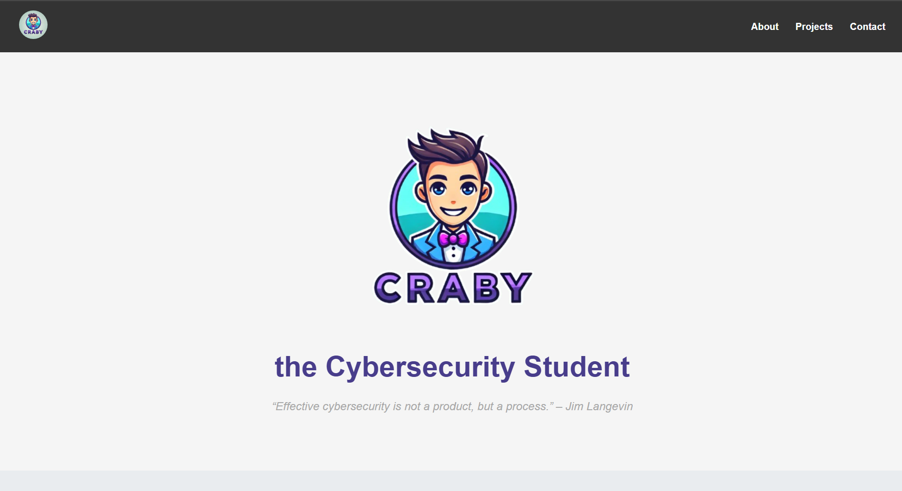

# Personal Portfolio Website  

> This is my **final CSS project** from the **Codedex CSS course**:  
It is a **personal portfolio website**, where I present myself, my projects, and my social links.  

---

## Table of Contents  

- [Features](#features)  
- [Future Updates](#future-updates)  
- [License](#license)  

---

## Features  

- Responsive **navigation bar** with smooth scrolling  
- **Landing section** with a motivational cybersecurity quote  
- **About Me** section with bio and profile picture  
- **Projects showcase** with GitHub links and live demos (which are turned off now) 
- **Contact section** with links to social media (LinkedIn, Discord, Instagram)  
- Modern and clean **UI design** with shadows, hover effects, and rounded corners  

---

## Future Updates  

- Add **JavaScript animations** (fade-in, scroll effects)  
- Implement a **dark mode toggle**  
- Make the **projects section** dynamically load content  
- Add a **contact form** for direct messages  

---

## License  

This project is licensed under the MIT License.  
