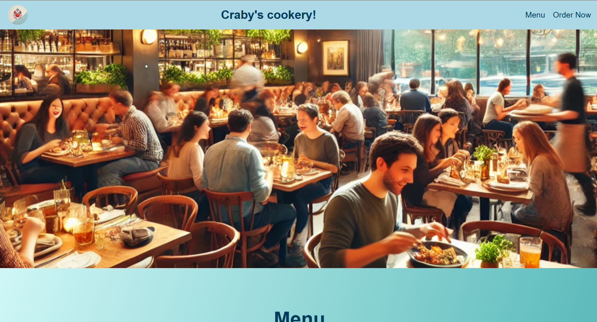

# Craby's Cookery  

> This is my **final HTML project** from the **Codedex HTML course**:  
It is a **restaurant-style website**, where I present a menu, food images, and an order form.  

---

## Table of Contents  

- [Features](#features)  
- [Future Updates](#future-updates)  
- [License](#license)  

---

## Features  

- Sticky **navigation bar** with quick links to Menu and Order sections  
- Beautiful **gradient background** for a modern look  
- **Menu section** with images, descriptions, and prices of meals  
- **Order form** with input fields for quantity, checkboxes for sauces, and a text area for special requests  
- Responsive and user-friendly layout with clean design  

---

## Future Updates  

- Add **JavaScript functionality** to make the order form interactive  
- Implement a **cart and checkout system**  
- Add more **menu items with categories**  
- Improve **responsiveness** for mobile devices  

---

## License  

This project is licensed under the MIT License.  
