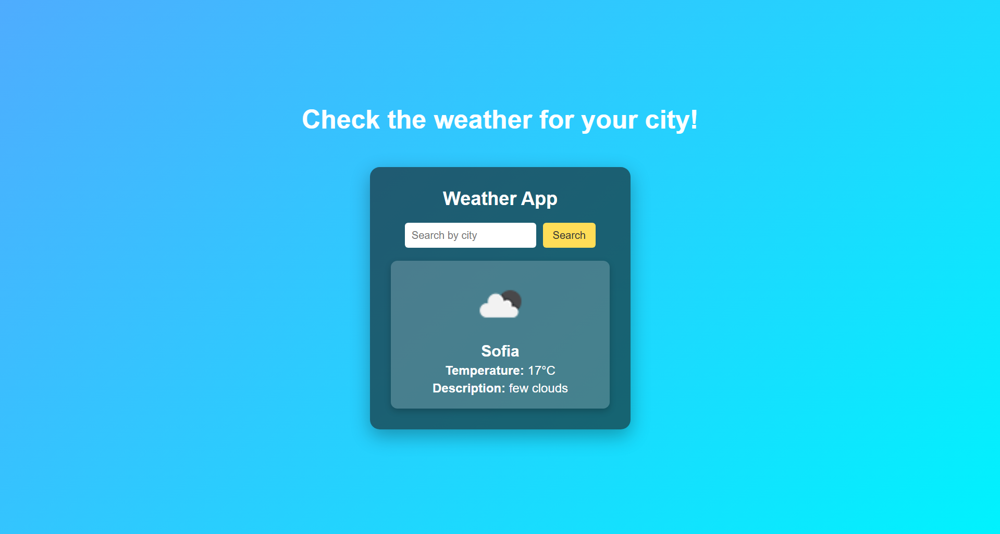

# Weather App 🌦️

> This is a **Weather App project** built with **HTML, CSS, and JavaScript**.  
It allows users to **search for the current weather** in any city by entering its name.  

---

## Table of Contents  

- [Features](#features)  
- [Future Updates](#future-updates)  
- [License](#license)  

---

## Features  

- Modern **UI design** with gradient background and card layout  
- **Search bar** to look up weather by city name  
- Dynamic **weather display** (temperature, description, and weather icon)  
- Interactive **search button** with hover effects  
- Responsive and clean design for better user experience  

---

## Future Updates  

- Add **5-day weather forecast**  
- Detect **user's location automatically** using Geolocation API  
- Show additional weather details (humidity, wind speed, feels-like temperature)  
- Improve mobile responsiveness  

---

## License  

This project is licensed under the MIT License.  
